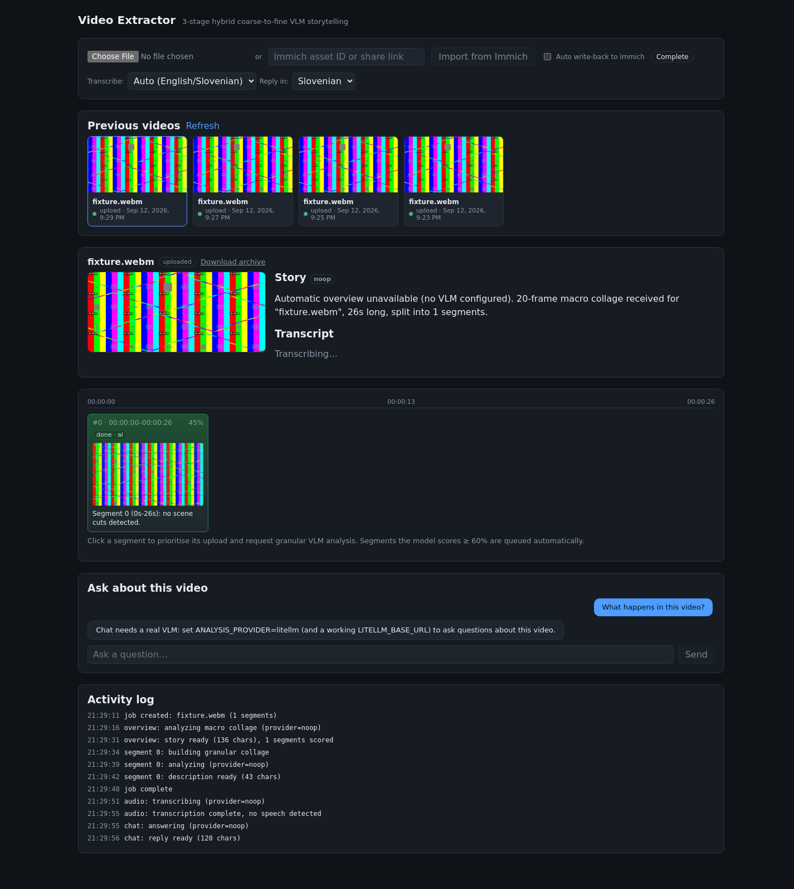

# video-extractor

[](https://github.com/rokelvisar/storyframe/actions/workflows/ci.yml)
[](LICENSE)

Intelligent, asynchronous **coarse-to-fine** analysis of large videos (2 GB+) for
VLM "storytelling" — a single Docker container bundling an Angular SPA and a Go +
FFmpeg backend.



```
┌─ Browser ────────────────────────────────┐     ┌─ Go backend (one container) ───────────┐
│ 1. <video>+<canvas> → macro collage      │──►  │ POST /overview → VLM story + interest  │
│    (16–24 stamped frames, ~1–2 MB)       │     │                  scores per segment    │
│ 2. WebAudio/MediaRecorder → Opus (~8 MB) │──►  │ POST /audio    → Whisper transcript    │
│ 3. tus upload, 1 upload / segment,       │──►  │ /files/*  (tusd) → on each segment:    │
│    interesting segments first            │     │   FFmpeg scene-detect + tile + drawtext│
└──────────────────────────────────────────┘     │   → granular contact sheet + VLM desc  │
                                                 │ reassemble parts → full archive        │
                                                 └───────────────────────────────────────┘
```

**Or skip the browser entirely** and import straight from your own Immich by
asset id or share link (`POST /api/v1/jobs/from-immich`) — the backend
downloads the asset and builds Stage 1/2 itself with FFmpeg, then joins the
same pipeline. See [Immich import](#immich-import) below.

## Quick start (local)

```bash
# 1. build the image
npm run docker:build          # -> video-extractor:local

# 2. run it (noop AI provider; no external calls)
ANALYSIS_PROVIDER=noop docker compose up

# 3. open http://localhost:8080 and pick a video file
```

Wire a real model by setting the LiteLLM env vars (any OpenAI-compatible gateway):

```bash
ANALYSIS_PROVIDER=litellm \
LITELLM_BASE_URL=https://your-gateway \
LITELLM_API_KEY=sk-... \
LITELLM_VLM_MODEL=<vision-model> \
LITELLM_WHISPER_MODEL=<whisper-model> \
docker compose up
```

## Development

Prereqs: Node ≥ 20.19 / 22.12 (repo uses nvm `v24`), Go ≥ 1.22, FFmpeg, Docker.

```bash
nvm use 24
npm ci

# backend (serves API + tus; SPA is a placeholder unless embedded)
cd backend && go run ./cmd/server        # PORT=8080 DATA_DIR=./data

# frontend with live reload, proxied to :8080
npm --workspace frontend run start       # http://localhost:4200
```

Tests:

```bash
cd backend && go vet ./... && go test ./...
npm --workspace frontend run test:ci     # Vitest, pure-logic modules
scripts/e2e.sh                           # full container smoke test
```

## Configuration

| Env | Default | Meaning |
|---|---|---|
| `PORT` | `8080` | HTTP listen port |
| `DATA_DIR` | `/data` | uploads, SQLite (unless `MYSQL_DSN` set), collages, archive |
| `MYSQL_DSN` | — | job store backend; unset = local SQLite file (`DB_PATH`). Set to a go-sql-driver/mysql DSN (`user:pass@tcp(host:3306)/dbname?parseTime=false`) to persist jobs in MySQL/MariaDB instead — same "Previous videos" timeline either way, but survives container/volume loss and is queryable outside the app |
| `ANALYSIS_PROVIDER` | `litellm` | `litellm` \| `noop` (auto-falls back to `noop` if no `LITELLM_BASE_URL`) |
| `LITELLM_BASE_URL` / `LITELLM_API_KEY` | — | OpenAI-compatible gateway |
| `LITELLM_VLM_MODEL` / `LITELLM_WHISPER_MODEL` | placeholders | model ids |
| `FFMPEG_WORKERS` | `2` | granular contact-sheet worker pool size |
| `IMMICH_BASE_URL` / `IMMICH_API_KEY` | — | your Immich instance; enables `POST /jobs/from-immich`. `IMMICH_API_KEY` is only needed for asset-id imports — share-link imports use the link's own public key |
| `IMMICH_WRITEBACK` | `true` | write the finished analysis back onto the source asset's description + custom metadata in Immich; `false` to disable |
| `TRANSCRIBE_LANGUAGE_HINT` | `en,sl` | comma list = soft Whisper `prompt` steer; single code = forced `language`. Per-job override: `languageHint` |
| `OUTPUT_LANGUAGE` | `sl` | language the VLM writes the story/descriptions/chat replies in. Per-job override: `outputLanguage` |

## Immich import

Paste an asset id or a `https://<host>/share/<key>` link in the "Import from
Immich" box instead of picking a file. Immich returns no CORS headers, so this
is entirely server-side: the backend resolves the asset (`GET
/api/assets/{id}` with your API key, or the public `GET
/api/shared-links/me?key=` for a share link), streams the original down, then
builds the macro collage and audio track with FFmpeg itself before handing off
to the normal pipeline — the timeline, VLM analysis and archive assembly are
identical to a browser upload. A share link must have downloads enabled
(`allowDownload`); one that covers several assets needs `assetId` alongside it
to pick which one.

Once analysis finishes, an Immich-sourced job's raw video is deleted from
local disk (the original is already safe in Immich — see `immichAssetId`),
keeping only the small derived artifacts (collages, audio, chat). Locally
uploaded jobs keep their archive, since that's the only copy that exists.

The finished analysis can also be written back onto the source asset in
Immich (`IMMICH_WRITEBACK` master switch, default on): the story goes into
the asset's **description** (visible right in Immich's own UI, in a clearly
delimited block so re-analyzing the same asset replaces it instead of piling
up duplicates — anything you wrote yourself is left alone), and the full
structured analysis (story, transcript, every segment's description) into
Immich's custom **asset metadata** sidecar under the key `video-extractor`
(`GET /api/assets/{id}/metadata/video-extractor` on your Immich), for any
other tooling that wants to query it. Best-effort — a write-back failure never
affects the job itself.

By default write-back is **manual**: once a job is complete, click "Write
back to Immich" on the page (or `POST /jobs/{id}/immich-writeback`). Check
"Auto write-back to Immich" before importing to have it happen automatically
on completion instead (`Job.immichAutoWriteback`, `immichWrittenBack` tracks
whether it's happened at least once).

## Chat

Once a job's overview story is ready, ask it follow-up questions in the "Ask
about this video" panel — grounded in the story, transcript and every
segment's description (plus the macro collage image on the first turn).
History is saved on the job, so it survives a page reload.

## Activity log

Every job carries a running "Activity log" (visible on the page under Chat) of
what the pipeline is doing: downloading/collage/audio steps, per-segment
analysis, and which AI model is being tried for each Whisper/VLM call —
including fallback attempts when a model 429s or errors and the chain moves to
the next one. It's server-persisted (`Job.events`, capped to the most recent
300 entries) so it survives a page reload, and is the easiest way to see which
model actually answered a given call.

## Previous videos

Every job ever created shows up in the "Previous videos" panel (thumbnail +
filename + origin + date, newest first) — click one to load it back up, exactly
as it was left, without re-running anything. Backed by `GET /api/v1/jobs`
(`Store.ListJobs`). Job storage defaults to a local SQLite file
(`DB_PATH`/data volume); set `MYSQL_DSN` to persist to an existing MySQL/MariaDB
server instead (`Store.OpenMySQL`) so history survives a container/volume
rebuild and is queryable outside the app.

## API

`GET /api/v1/jobs` · `POST /api/v1/jobs` · `POST /api/v1/jobs/from-immich`
· `GET /api/v1/jobs/{id}` · `POST /api/v1/jobs/{id}/overview`
· `POST /api/v1/jobs/{id}/audio` · `POST /api/v1/jobs/{id}/segments/{sid}/process`
· `POST /api/v1/jobs/{id}/finalize` · `POST /api/v1/jobs/{id}/chat`
· `POST /api/v1/jobs/{id}/immich-writeback` · tus at `/files/*` · generated media at `/media/*`.
Full contract in [`shared/openapi.yaml`](shared/openapi.yaml).

## Deploy

CI builds and publishes `ghcr.io/<your-fork>/<repo-name>` on every push. See
[`deploy/README.md`](deploy/README.md) for an optional Portainer-based
deployment example, or just `docker run`/`docker compose` the published image
directly.

## Documentation

This file is a quickstart. For the deep-dive — architecture, job lifecycle,
every feature explained in detail, and why things are built the way they are
— see [`docs/`](docs/), starting with [`docs/README.md`](docs/README.md).

## Contributing

Issues and PRs welcome — see [`CONTRIBUTING.md`](CONTRIBUTING.md).

## License

[MIT](LICENSE)
